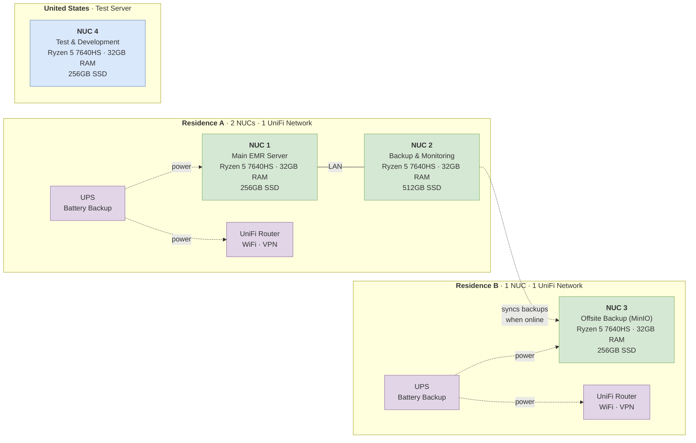
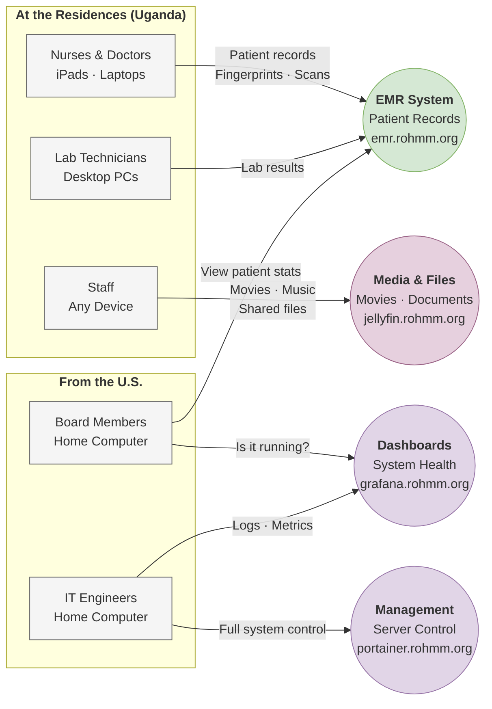
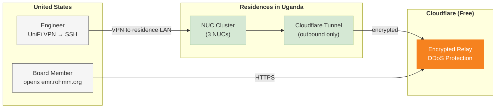
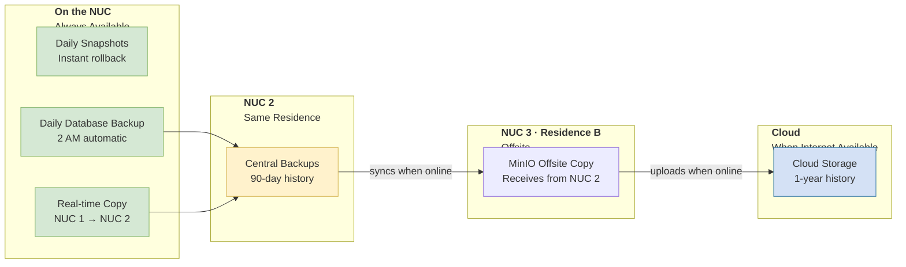
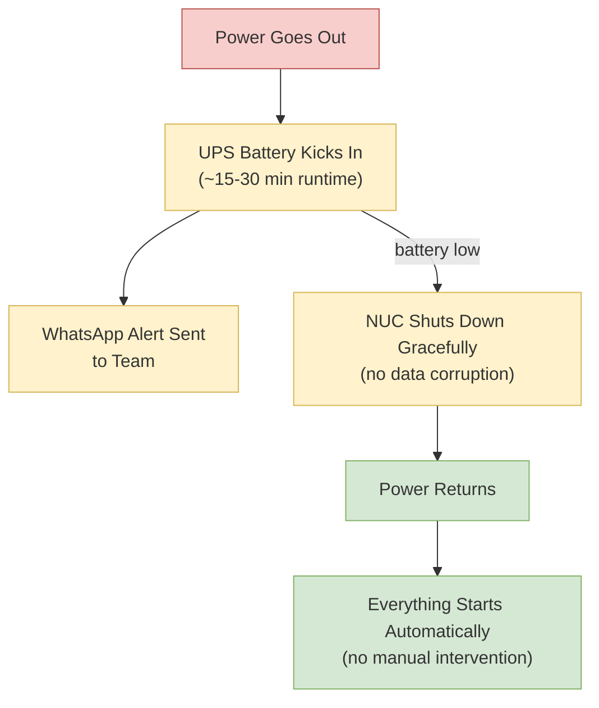
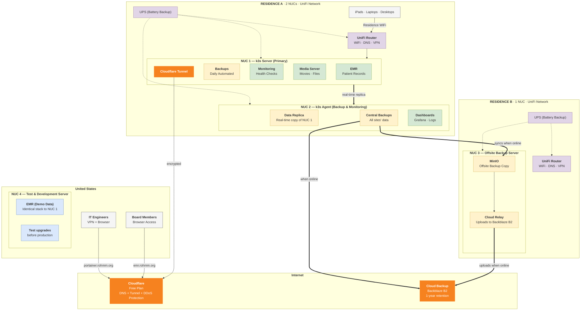

# UgandaEMR+ System Overview

**Ray of Hope Medical Missions — Electronic Medical Records for Uganda**

---

## What Is This?

A complete electronic medical records (EMR) system deployed on small, silent mini PCs (GMKtec NucBox M6 Ultra) at two residences in Uganda, plus a test server in the U.S. for development and training. Doctors, nurses, and lab techs use it daily for patient registration, diagnoses, prescriptions, and lab results.

The system is designed to work **with or without internet** — the EMR runs locally at Residence A and syncs backups to an offsite server at Residence B, which relays them to the cloud. A 4th NUC in the U.S. runs the identical EMR stack with demo data, so engineers can test upgrades and train staff before changes go to production.

---

## The Hardware

Each mini PC (GMKtec M6 Ultra, AMD Ryzen 5 7640HS) is about the size of a paperback book. Low power (~35W), plugs into any wall outlet. NUC 4 lives at an engineer's home in the U.S. — identical hardware running the same EMR with demo data for testing and training.

---

## Who Uses It and How

| Who | Where | What They See | URL |
|-----|-------|---------------|-----|
| **Nurses & Doctors** | Residence WiFi | Patient records, prescriptions, diagnoses | `emr.rohmm.org` |
| **Lab Techs** | Residence WiFi | Lab orders and results | `emr.rohmm.org` |
| **Staff** | Residence WiFi | Movies, music, shared files | `jellyfin.rohmm.org` |
| **Board Members** | Home (U.S.) | System health dashboard, EMR access | `grafana.rohmm.org` |
| **IT Engineers** | Home (U.S.) | Full server management, logs, metrics | `portainer.rohmm.org` |

> Everyone uses the **same URLs** whether they're on-site or remote. No VPN needed for browser access.

---

## How Remote Access Works

- The NUCs **never expose ports** to the internet — they only make outbound connections
- Board members just open a URL in their browser — no software to install
- Engineers use the UniFi router's built-in VPN for full server access

---

## How Data Is Protected

| Protection | What It Covers | Recovery Time |
|------------|---------------|---------------|
| **Daily snapshots** | Everything on the server | Instant (click to revert) |
| **Daily database backup** | All patient records | ~5 minutes |
| **Real-time replication** | Database + scans to NUC 2 | Automatic failover |
| **Cloud backup** | Everything, uploaded when internet is available | ~30 minutes |

**If NUC 1 dies** → patient data exists on NUC 2 (same residence).
**If both NUCs at Residence A are lost** (fire/theft) → restore from NUC 3 at Residence B (offsite MinIO), or from cloud backup. NUC 3 can also be promoted to a temporary EMR using `deploy-standalone.sh` for disaster recovery.

---

## What Happens During a Power Outage

The UPS gives the NUC time to shut down safely. When power returns, everything comes back automatically — no one in Uganda or the U.S. needs to do anything.

---

## Alerts (WhatsApp + Email)

The system monitors itself and sends alerts when something needs attention:

| Alert | What It Means |
|-------|---------------|
| **Backup failed** | Nightly backup didn't complete — check the server |
| **Server down** | A service crashed and couldn't restart |
| **Disk filling up** | Storage is getting full — add a drive or clean up |
| **Power outage** | UPS is running on battery |
| **Tunnel disconnected** | Remote access (from U.S.) is down |

Alerts go to **WhatsApp** (instant) and **email** (formal record).

---

## Storage Growth & Scaling

| Data Type | Growth Per Year | Notes |
|-----------|----------------|-------|
| Patient records (database) | ~250 MB | Text data — very small |
| Scans, PDFs, fingerprints | ~12 GB | Ultrasound, X-ray, documents |
| **Total** | **~12 GB/year** | |

At this rate, the 256GB SSD lasts **10+ years** before needing expansion. When more space is needed, each mini PC has **2 M.2 NVMe slots** — just plug in a second SSD ($40-80).

---

## Cost Summary

| Item | Cost | Frequency |
|------|------|-----------|
| NUC hardware (x4) | ~$400-500 each | One-time |
| 32GB RAM per NUC | ~$80 each | One-time |
| 256-512GB SSD per NUC | ~$30-60 each | One-time |
| UPS (x2) | ~$50-100 each | One-time |
| UniFi router (x2) | ~$100-200 each | One-time |
| Cloudflare (DNS + Tunnel) | **Free** | Ongoing |
| Cloud backup (Backblaze B2) | ~$6/TB/month | Ongoing |
| Domain (rohmm.org) | Already owned | Ongoing |
| **Software licenses** | **$0 (all open-source)** | - |

**Estimated ongoing cost: < $1/month** (cloud backup only, until data grows significantly).

---

## Network Diagram (Full Picture)

---

## Key URLs

| URL | What It Is | Who Uses It |
|-----|-----------|-------------|
| `emr.rohmm.org` | Patient records (EMR) | Clinical staff, board |
| `grafana.rohmm.org` | System health dashboards | Board, engineers |
| `portainer.rohmm.org` | Server management panel | Engineers, board (read-only) |
| `jellyfin.rohmm.org` | Movie/music streaming | Staff (local only) |
| `rohmm.org` | Organization website | Public (unchanged) |
